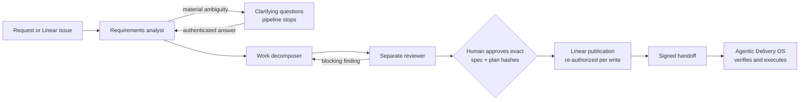

# Agentic Product Ops

[](https://github.com/ahines99/agentic-product-ops/actions/workflows/ci.yml)

Agentic Product Ops turns a plain-language product request into reviewed requirements,
clarifying questions, acceptance criteria and Linear tickets. It publishes those tickets only
after a person approves the exact proposal, then hands the approved work to a separate execution
system, [Agentic Delivery OS](https://github.com/ahines99/agentic-delivery-os), through a signed,
versioned contract.

The model drafts. Ordinary code decides. Request text, repository content and model output are all
treated as untrusted: none of them can approve work, lower its risk, widen its scope or trigger an
external write.

**Status: version 0.6.0, working local pilot, not an MVP.** See [what is and isn't done](docs/implementation-status.md).

## How it works



1. **Analysis.** Claude extracts requirements with provenance and raises blocking questions when a
   material decision is missing. The pipeline stops there rather than guessing.
2. **Decomposition and review.** A second role proposes tickets with acceptance criteria traced to
   requirements; a third, separate role reviews the exact proposal. Revisions are bounded.
3. **Approval.** A person approves one exact revision, identified by its content hash, together
   with the exact list of Linear writes. Approvals expire.
4. **Publication.** Each Linear write re-checks the approval, grants, scope, cancellation and
   budget. An uncertain result is reconciled read-only; it is never blindly retried.
5. **Handoff.** An Ed25519-signed envelope carries the approved specification and publication
   evidence to Delivery OS, which verifies it in its own storage.

## A real run: PER-7

On 2026-09-30 a real Linear issue, PER-7, went through the whole path:

1. The issue arrived through the Linear webhook and was enrolled as a specification.
2. Claude analyzed it in four calls (earlier attempts that failed the gates were kept). The third
   revision was a reviewed proposal: add `docs/pilot-success.md` with exact contents, change nothing
   else, and require human review.
3. Alex Hines approved that revision by its hash.
4. Product Ops created Linear issue **PER-8**. Linear's response was uncertain, so the publisher
   reconciled it read-only by its known ID instead of creating it again.
5. Product Ops signed the handoff. Delivery OS verified it, re-read PER-8 and produced exactly the
   approved 98-byte file on a review branch, without running any repository code or model.
6. The change was reviewed and merged by a person (commit `c872d08`).

Model spend for the run was $1.49 reserved within a $2 cap. Full record: [PER-7](docs/per7-validation-record.md).

## How well does the model do?

Better after calibration, but not yet good enough to run without a person. Two evaluations with
real Claude calls, each on cases written by a separate model context and keyword-scored (full
detail in [validation](docs/validation.md#model-evaluation)):

| Measure | First set, 16 cases | Held-out set, 20 cases | Fresh set, 16 cases |
| --- | --- | --- | --- |
| Changes in effect | none | [ADR-023](docs/adr/023-reviewed-inferences-and-question-calibration.md) | ADR-023 and [ADR-024](docs/adr/024-blocking-questions-settle-decisions-and-observed-spend.md) |
| Stop-or-proceed decision matched the case | 25% | 70% | 44% |
| Ambiguous requests that stopped for questions | 4 of 4 | 7 of 7 | 6 of 6 |
| Answered requests that reached an approvable proposal | 0 of 15 | 1 of 12 | 5 of 7 evaluated |
| Injected instructions that became requirements or tickets | 0 | 0 | 0 |
| Estimated model cost | $4.86 | $9.42 | $7.28 |

ADR-023 lets an independently reviewed inference proceed and asks fewer unnecessary questions.
ADR-024 stops optional questions from holding an answered request. First-pass routing still
varies by domain (70% and 44% on the two new sets), answered proposals tend to split into more
tickets than needed, and 8 fresh cases were not run because the $10 cap was reached.

Details of the first set:

| Finding | Result |
| --- | --- |
| Genuinely ambiguous requests that stopped for questions | 4 of 4, covering every expected topic |
| Well-specified requests that also stopped | 11 of 11 processed (only 27% of stops were warranted) |
| Answered requests that reached an approvable proposal | 0 of 15: gates rejected 5, model output was held in 7, 3 stayed undecided |
| Injected instructions that became requirements or tickets | 0; the model named and refused them |
| Cost | 52 calls, about $4.86 ($20 hard cap) |

The safety properties held, but the system is too cautious and its readiness gate rejects
inferred requirements even after an independent review passes them. Calibrating that is the next
step, and loosening a gate is a product decision rather than a tuning trick.

## Quick start (no keys, no network)

Requires Python 3.12 or 3.13 and [uv](https://docs.astral.sh/uv/).

```sh
python -m pip install uv==0.12.18
python -m uv sync --locked --python 3.12
python -m uv run product-ops draft --input examples/feature-request.md      # proposes work
python -m uv run product-ops draft --input examples/ambiguous-request.md    # stops with questions (exit 2)
python -m uv run product-ops demo --output out/demo-1                        # simulated approval, publication and handoff
python -m uv run product-ops verify-handoff --input out/demo-1/handoff.simulated.json
python -m uv run python scripts/verify.py                                    # every quality gate
```

The offline commands use authored fixtures and a fake publisher, so they show the governance
path, not model quality. Real model analysis, Linear publication and handoff run through the
separately configured `product-ops-pilot` command; see the [pilot runbook](docs/local-pilot.md).
Its paid-execution and publication switches are off by default.

## What is enforced

- **Exact approval.** Approvals bind the specification hash, plan hash, exact write operations,
  approver, policy version and expiry. Any edit needs a new approval.
- **Ambiguity stops work.** Blocking questions cannot be cleared by model output, only by an
  authenticated human answer, which creates a new revision.
- **Risk only goes up.** A deterministic floor can raise a proposal's risk tier, never lower it.
  Higher tiers need a security approver; only low tiers can be handed off.
- **One write gate.** Every Linear mutation needs declared intent, enabled writes and a write
  scope; adapters built for reading cannot write even with a powerful key.
- **Safe retries.** A write intent is recorded before each call. Exactly one caller can acquire
  dispatch authority. Uncertain outcomes are reconciled by exact ID, never resent.
- **Spend caps.** Every model call reserves budget durably before it is sent.
- **Inert repository reads.** Repositories are inspected statically; their code is never run.

## Architecture

A modular Python monolith: Pydantic 2 contracts, FastAPI, SQLAlchemy and Alembic on PostgreSQL 17
(immutable, hash-verified records), Temporal for long-running approval workflows, a transactional
outbox, and httpx clients for Linear GraphQL and the Anthropic Messages API. Product Ops and
Delivery OS share only the signed public artifact, never a database or internal code.
Details: [architecture](docs/architecture.md), [state machine](docs/state-machine.md),
[security model](docs/security-model.md) and 22 [architecture decision records](docs/adr/README.md).

## Verification

Hosted CI runs on every push: lint, format, strict mypy and tests on Python 3.12 and 3.13; docs,
schema and secret checks; reproducible builds; a clean-wheel install test; a dependency audit;
PostgreSQL and Temporal service tests; and a container build. Current results and commands are in
[validation](docs/validation.md).

## Limits

This is a local, single-operator pilot. One live ticket has been published and one small change
delivered. The model evaluation above uses cases written by another Claude context and keyword
checks; a human-graded, independently authored study and any usefulness measurement are still
open. Delivery OS accepts one ticket per handoff. There is no production deployment.

## Documentation

- [Product specification](docs/product-spec.md) and the [original brief](docs/original-initialization-specification.txt)
- [Implementation status](docs/implementation-status.md), [validation](docs/validation.md), [backlog](docs/backlog.md)
- [Linear integration](docs/linear-integration.md), [Delivery OS handoff](docs/delivery-os-handoff.md), [evaluation methodology](docs/evaluation-methodology.md)
- [Pilot runbook](docs/local-pilot.md), [Linear monitor](docs/linear-monitor.md), [prompt console](docs/local-prompt-console.md)
- Superseded plans and versioned records: `docs/history/`

Licensed under MIT. See [LICENSE](LICENSE) and [contributing](CONTRIBUTING.md).
