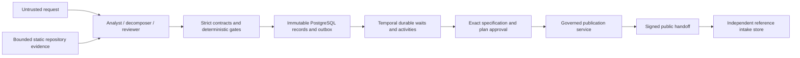

# Architecture

Agentic Product Ops is a modular monolith. Models propose; deterministic code owns lifecycle gates, ambiguity, risk, scope, approval, idempotency and external writes. Product Ops defines approved work. Delivery OS executes it in its own persistence.

These are exercised component connections, not a claim of deployed end-to-end service. CLI runs authored recordings. Configured activities can use the Responses adapter; only mock transport has been exercised. Native publication is a separately invoked service tested against mock GraphQL, not wired to the disabled HTTP publish route or automatic Temporal writes. The reference consumer is not installed in Delivery OS.

## Ownership and modules

| Module | Responsibility |
| --- | --- |
| `domain/`, `policies/` | Frozen Pydantic contracts, source/digest/provenance/DAG validation, additive revision rules, risk and approval |
| `adapters/model/`, `services/revisions.py` | Distinct roles, strict structured output, token preflight and cost reservation, bounded reviewed revisions |
| `services/durable_analysis.py` | Intent-before-call, immutable request/response/result/usage, cached recovery, uncertain-call hold |
| `adapters/repository/`, `services/grounding.py` | Inert local AST reads, pinned GitHub metadata, lexical evidence coverage and explicit gaps |
| `api/`, `services/authority.py`, `adapters/identity/` | Authenticated commands, server-owned grants, pinned JWT keys, durable revocation, encrypted OAuth vault |
| `adapters/persistence/` | PostgreSQL records, immutable triggers, control locks, command results and transactional outbox; optional artifact encryption |
| `workflows/` | Temporal history, approval waits, stored-receipt validation, restart/replay, revision outbox and cancellation |
| `adapters/linear/`, `services/native_publication.py` | Scoped native issue/relation plan, OAuth PKCE, exact metadata checks, per-write authority and UNKNOWN reconciliation |
| `services/signed_handoff.py`, `product_ops_handoff/` | Signed public envelope and separately persisted reference intake without producer imports |
| `services/operations.py`, `evaluation/` | Bounded redacted exports, routing evidence and explicitly adjudicated semantic reports |

PostgreSQL owns immutable artifacts and command/operation evidence. Temporal owns durable orchestration history and waits; no second editable lifecycle column can override it. Commands commit outbox and records together. Signals contain stored receipt IDs, never authoritative booleans. Revision-specific workflows cannot approve superseding content. Role/publication reservations and command changes share control locks. Current authority is rechecked after provider metadata reads immediately before native mutation.

## Command surface

Implemented: intake, intake/specification/review/plan reads, allowlisted repository snapshot reads, clarification, approve, reject and cancel. Every command is bounded, tenant scoped and idempotent. Native approval requires the exact rendered plan digest. Snapshot intake can require the exact inspected digest; arbitrary filesystem paths cannot enter through HTTP. Approval additionally requires persisted passing review. Clarification creates new immutable provenance and requires fresh analysis/review.

The factory defaults to deny-all identity. `/health` returns 200; `/ready` and `/v1/specifications/{id}/publish` return 503. Publication/handoff GET routes read records if present. No UI or arbitrary state PATCH exists. Live factory wiring, production identity and deployed readiness are external deployment work.

## Untrusted inputs and execution

Repository inspection never imports, runs, installs dependencies from, writes to, or follows URLs embedded in source. Only bounded static metadata enters role context. GitHub pins commit/tree/blob associations and recomputes blob hashes; provider TLS metadata supplies commit-to-tree association, not an independently verified signed commit. Lexical matches do not prove semantic relevance. Local file checks are not an OS sandbox.

Runtime configuration is operator owned. Each role receives a distinct context and trusted policy separate from untrusted JSON. Model output can suggest decomposition, never identity, state, policy or approvals. Two review attempts and a shared call/cost budget bound revisions. Calls with missing completion evidence hold rather than silently repeat billable work. Blocking findings and first failures are retained.

## Operations

Pinned development containers, real PostgreSQL/Temporal integration and isolated backup/restore are exercised. SQLite is an explicit test double, plus the independent reference consumer's own store. AES-GCM protects configured artifact/operation payloads; raw role access expiry preserves immutable ciphertext and audit metadata. Metadata exports separate role and publication duration; no production collector or human-wait instrumentation is claimed. See [status](implementation-status.md), [validation](v04-validation-record.md), and [ADRs](adr/README.md).
