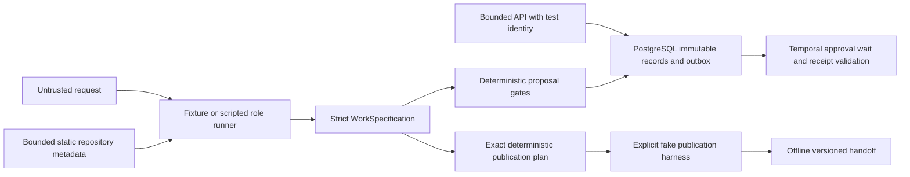

# Architecture

Agentic Product Ops is a modular monolith. Models propose; deterministic code controls lifecycle, ambiguity, risk, authorization, team/repository scope, idempotency and writes. Product Ops defines approved work; Delivery OS executes it using its own persistence. [ADR-007](adr/007-offline-service-expansion.md) extends the original [M0 decision](adr/001-offline-foundation.md) with exercised service components.

These are executable components, not a claim that every arrow in the target product is connected. The API drafts from fixtures. The three-role pipeline is a separate CLI/test path. Temporal validates persisted proposals and approvals but does not call models or publish. A human identity provider and live Linear transport are absent; default ingress denies all. The offline handoff remains a separate simulation path.

## Modules and state ownership

| Module | Responsibility |
| --- | --- |
| `domain/contracts.py` | Immutable schemas, canonical digest, traceability and graph validation |
| `policies/validation.py` | Trusted policy, risk floor, ambiguity/review gates, scope and approval binding |
| `adapters/model/` | Strict role contracts, independent contexts, recorded provider, usage/budget receipts |
| `adapters/repository/` | Local static metadata, bounded search, digested snapshots and mock GitHub reader |
| `api/app.py` | Commands, test authentication, idempotency and immutable revisions; default deny |
| `adapters/persistence/store.py` | PostgreSQL immutable artifacts, commands, audits, outbox and publication intents |
| `workflows/governance.py` | Temporal approval wait, signal receipt validation, cancellation and timeout |
| `workflows/activities.py` | Database activities and replay-safe outbox dispatch/reconciliation |
| `workflows/lifecycle.py` | Full target graph's pure transition validator; unavailable live transitions denied |
| `services/publication.py` | Durable fake-provider reservation, authorization and reconciliation harness |
| `adapters/linear/` | Canonical plan/rendering, in-memory fake, mock-only GraphQL transport |
| `adapters/artifacts/handoff.py` | Public handoff export and independent deserialization/integrity verification |
| `evaluation/harness.py` | Frozen routing corpus and report identity; no semantic claims |

PostgreSQL stores immutable source/specification/clarification/approval records and audit metadata. Temporal owns durable workflow history and waits; a database row is not a second lifecycle authority. Commands and outbox jobs commit together. Duplicate starts reconcile against workflow identity; decision signals carry only a stored receipt ID, never an authoritative approval boolean. A completed matching receipt query reconciles a lost outbox acknowledgement. Database constraints and PostgreSQL triggers enforce immutability independently of application calls. Reads recheck artifact digests.

Publication intents use unique workspace/operation keys. The simulator reserves UNKNOWN before a fake dispatch, rechecks a trusted advancing clock per operation, and reconciles exact content after uncertainty. It does not invent a real Linear persistence model. Delivery OS imports a future public artifact adapter, never these database classes.

## HTTP surface

Implemented: `POST /v1/intakes`, `GET /v1/intakes/{id}`, `GET /v1/specifications/{id}`, `GET /v1/specifications/{id}/review`, `POST /v1/specifications/{id}/clarifications`, `POST /v1/specifications/{id}/approve`, `POST /v1/specifications/{id}/reject`, `/health`, `/ready`. The publish route always denies with 503. Publication/handoff retrieval and cancellation/revocation commands remain future work. No arbitrary state PATCH or UI exists.

An approval is exact revision/digest-bound and checked against server scope, role and time. One immutable decision per revision prevents conflicting approval/rejection receipts. Clarification creates a new revision, invalidating old approval, and holds for reanalysis. Errors omit raw input and secrets. Review responses explicitly identify deterministic checks rather than model review.

## Repository and model boundary

Repository inspection never imports, executes, installs dependencies, follows source URLs or changes the inspected tree. Allowed local roots, entry/file/byte/depth/time limits, link exclusion, secret heuristics and content digests bound the input. Only static metadata enters the recorded pipeline; its original context cannot be replaced by a decomposer output. Snapshots describe a bounded working tree, not a clean Git commit or a behavioral proof.

Each role gets a fresh context identifier and role policy separate from untrusted JSON. Strict schemas, immutable requirements/uncertainties, review findings and deterministic gates constrain outputs. Provider usage and decimal estimates are distinct. The only provider is scripted, and role receipts are currently returned to callers rather than integrated into the durable lifecycle.

## Deployment and observability boundary

Alembic migrations and PostgreSQL/Temporal development services are exercised locally. SQLAlchemy SQLite is available only with explicit testing mode. Docker/Compose definitions are untested templates; the API image starts with deny-all authentication. No live credentials, provider writes or paid model calls are required by default tests or CI.

Durable audits contain bounded metadata, not free-form source/model text. Production trace exporters, separately measured wait/model/publication latency, retention, revocation and full service readiness remain in the backlog. See [implementation status](implementation-status.md) for precise evidence and gaps.
