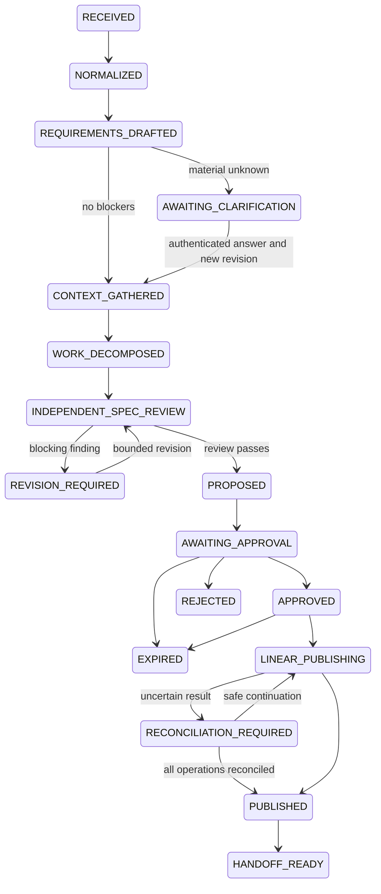

# State machine

This is the full target graph. The pure offline transition API intentionally denies production-only transitions. The exercised Temporal subset persists role preparation, clarification/revision outcomes, approval waits, stored-receipt validation, rejection, expiry, pause and cancellation. Native publication and signed handoff are separately exercised service components; automatic live workflow transitions remain disabled.

Each lifecycle object is bound to an exact content digest. Ready gates require schema, source/provenance, scope, risk, requirements, decomposition and passing distinct review. Human-decision flags and material questions cannot be cleared by untrusted JSON. Verified clarification receipts support additive new requirements; answers and original source/requirements cannot be erased or rewritten. New content creates a new immutable revision and invalidates prior approval.

Configured revision execution allows at most two review attempts under a shared call/cost budget. First failures remain stored. Ten clarification revisions are allowed by the API. Roles are executed off the async activity loop; persisted intent without completion holds for operator resolution. No uncertain inference is silently repeated. A new revision queues a new digest-bound workflow; the old run cannot validate its approval.

REJECTED, EXPIRED, HANDOFF_READY and CANCELLED are terminal in the target graph. Real local Temporal tests exercise restart, replay, timeout, cancellation, outbox reconciliation and reviewed clarification revision. Native publication locks and durable dispatch receipts separately enforce current authority before each write. A previously dispatched call can finish after cancellation; its observation cannot authorize another call. UNKNOWN permits exact reconciliation, not a blind create retry.

| Gate | Failure behavior |
| --- | --- |
| Material ambiguity / human decision | Hold before proposal and reject publication plan |
| Unsupported inferred requirement / duplicate title | Blocking objective review finding |
| Scope/risk/digest mismatch | Reject command |
| Stale, expired, rejected, future-dated, unauthorized approval | Zero new dispatches in fake/mock tests |
| Timeout after mock creation | UNKNOWN, stop remaining operations |
| Unavailable/mismatched reconciliation | Keep UNKNOWN, no create retry |
| Handoff risk outside consumer tiers | Deny export |

The API rejects arbitrary lifecycle patches. Signals request action and are not state authority; persisted receipts and deterministic activity checks authorize decisions. See [architecture](architecture.md) for the outbox bridge and [current limitations](implementation-status.md) for unwired states.
