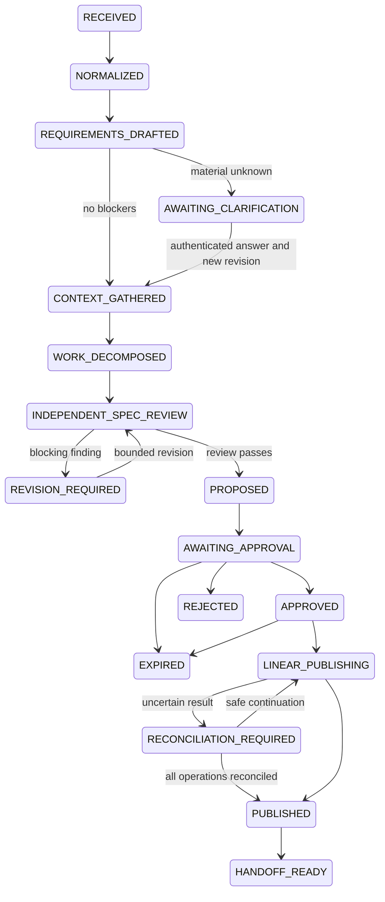

# State machine

This is the target workflow. M0 implements graph validation and conservative foundation guards, not Temporal execution. The CLI fixture router reports the authored fixture's offline endpoint, not a fabricated history of model runs. It does not claim to have performed independent review. The simulator exercises write invariants outside the production lifecycle and labels all evidence offline.

Each lifecycle object is bound to an exact content digest. Illegal skips and content changes are rejected. Ready transitions require valid schema, scope, risk, requirements, work decomposition, and no blocking findings. Resolved-question fields in source JSON do not count as authenticated clarification. M0 therefore denies exits from clarification that require the missing identity service, and denies APPROVED, LINEAR_PUBLISHING, PUBLISHED, and HANDOFF_READY transition commands. The fake demo is the only publication path and has no network capability.

Revision loops return to review and are capped at two; they cannot bypass a reviewer. A future immutable revision service creates a fresh lifecycle binding after content changes. REJECTED, EXPIRED, HANDOFF_READY, and CANCELLED are terminal. Cancellation is permitted from a nonterminal state and prevents later simulated dispatch. Durable accepted-cancellation races and model-outage pauses remain planned.

| Gate | Failure behavior |
| --- | --- |
| Material ambiguity / human decision | Hold before proposal and reject publication plan |
| Unsupported inferred requirement / duplicate title | Blocking objective review finding |
| Scope/risk/digest mismatch | Reject command |
| Stale, expired, rejected, future-dated, unauthorized approval | Zero new fake writes |
| Timeout after fake creation | UNKNOWN, stop remaining operations |
| Unavailable/mismatched reconciliation | Keep UNKNOWN, no create retry |
| Handoff risk outside consumer tiers | Deny export |

No API may expose arbitrary lifecycle patches when ingress is implemented.
