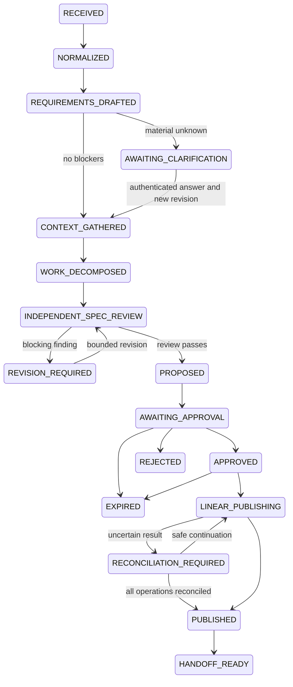

# State machine

This is the full target workflow. The pure M0 graph validator retains conservative foundation guards. Version 0.2 also implements a real Temporal subset: proposal checks, clarification hold, approval wait, stored-receipt validation, rejection, expiry, revision-required, pause and cancellation. It does not yet run model activities, resume clarification/revision loops, publish or hand off. CLI fixture endpoints do not fabricate model/workflow history. Scripted role runs identify their recorded provider explicitly.

Each lifecycle object is bound to an exact content digest. Illegal skips and content changes are rejected. Ready transitions require valid schema, scope, risk, requirements, work decomposition, and no blocking findings. Resolved-question fields in source JSON do not count as authenticated clarification. M0 therefore denies exits from clarification that require the missing identity service, and denies APPROVED, LINEAR_PUBLISHING, PUBLISHED, and HANDOFF_READY transition commands. The fake demo is the only publication path and has no network capability.

The target graph caps revision loops at two; they cannot bypass a reviewer. The API now creates immutable clarification revisions, but deliberately leaves them held pending reanalysis. Temporal binds its run to the original digest and rejects superseded receipts. REJECTED, EXPIRED, HANDOFF_READY and CANCELLED are terminal. Runtime tests exercise worker restart, replay, timeout and cancellation. The durable publication harness separately tests cancellation across publisher instances; its committed reservation is the boundary after which a call may finish.

| Gate | Failure behavior |
| --- | --- |
| Material ambiguity / human decision | Hold before proposal and reject publication plan |
| Unsupported inferred requirement / duplicate title | Blocking objective review finding |
| Scope/risk/digest mismatch | Reject command |
| Stale, expired, rejected, future-dated, unauthorized approval | Zero new fake writes |
| Timeout after fake creation | UNKNOWN, stop remaining operations |
| Unavailable/mismatched reconciliation | Keep UNKNOWN, no create retry |
| Handoff risk outside consumer tiers | Deny export |

The API rejects arbitrary lifecycle patches. Signals request action and are not state authority; persisted receipts and deterministic activity checks authorize decisions. See [architecture](architecture.md) for the outbox bridge and [current limitations](implementation-status.md) for unwired states.
